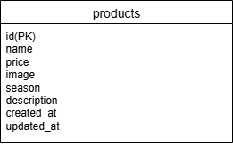

# mogitate
#   環境構築
・　git clone git@github.com:sugi3105/mogitate.git
・　docker-compose up -d --build

#Laravel環境構築
1. `docker-compose exec php bash`
2. `composer install`
3. 「.env.example」ファイルを 「.env」ファイルに命名を変更。または、新しく.envファイルを作成
4. .envに以下の環境変数を追加
``` text
DB_CONNECTION=mysql
DB_HOST=mysql
DB_PORT=3306
DB_DATABASE=laravel_db
DB_USERNAME=laravel_user
DB_PASSWORD=laravel_pass

5. アプリケーションキーの作成
・　php artisan key:generate

6. マイグレーションの実行
・　php artisan migrate

7. シーディングの実行
・  php artisan db:seed

## 使用技術
   php8.3.0
   Laravel8.83.27
   MySQL8.0.26

## ER図
　



　
　
## URL
   環境開発:http://localhost/
   phpMyAdmin: http://localhost:8080
